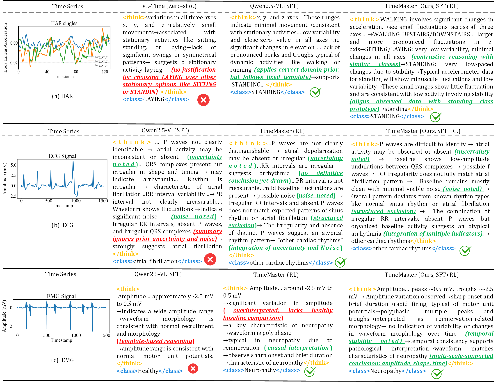

<h2 align="center">
TimeMaster: Training Time-Series Multimodal LLMs to Reason via Reinforcement Learning  
<br>
<b>@ <a href="https://berts-workshop.github.io/">BERT2S</a> NeurIPS 2025</b>
</h2>


<p align="center">
  <a href="https://arxiv.org/abs/2506.13705">
    </a>
  &nbsp;
  <a href="https://github.com/langfengQ/TimeMaster">
    </a>
  &nbsp;
  <a href="https://huggingface.co/collections/langfeng01/timemaster-68554b6ec27ee539d07a6e40">
    </a>
</p>

`TimeMaster` is a reinforcement‑learning‑enhanced framework for training **time‑series multimodal large language models (MLLMs)**. It enables **structured, interpretable reasoning** over visualized time‑series signals and has been evaluated on real‑world tasks such as EMG, ECG and Human Activity Recognition (HAR) using Qwen2.5‑VL‑3B‑Instruct.

# News
- [2025.09.23] `TimeMaster` accepted at NeurIPS 2025 Workshop [BERT2S](https://berts-workshop.github.io/).
- [2025.06.21] SFT model released. See [link](https://huggingface.co/collections/langfeng01/timemaster-68554b6ec27ee539d07a6e40).
- [2025.06.21] Code released.
- [2025.06.16] Our paper on `TimeMaster` released. See [link](https://arxiv.org/abs/2506.13705).

# Table of Contents

- [Overview](#overview)
- [Installation](#installation)
  - [1. Set Up Conda Environment](#1-set-up-conda-environment)
  - [2. Data Preprocessing](#2-data-preprocessing)
  - [3. Model Preparation](#3-model-preparation)
- [RL Training](#rl-training)
  - [1. Training](#1-training)
  - [2. Evaluation](#2-evaluation)
- [Usage Tips](#usage-tips)
- [Reasoning Example](#reasoning-example)
- [Citation](#citation)
- [Acknowledgements](#acknowledgements)

# Overview

`TimeMaster` performs structured reasoning on time series images using reinforcement learning with composite rewards. The framework integrates format, hard, and soft rewards to improve classification, interpretability, and clinical insight generation.


# Installation
## 1. Set Up Conda Environment
```bash
conda create -n timemaster python=3.11 -y
conda activate timemaster

pip3 install torch==2.6.0 --index-url https://download.pytorch.org/whl/cu124
pip3 install flash-attn==2.7.4.post1 --no-build-isolation
pip3 install -e .
pip3 install vllm==0.8.2

pip3 install -r requirements_timemaster.txt
```

## 2. Data Preprocessing
> Currently, we provide the CTU dataset. 

To preprocess the dataset, simply run the following script:

```bash
bash example/data_preprocess/ctu.sh
```
After successful execution, the following preprocessed data will be generated:
```
data/ctu_image/
    ├── images/
    ├── test/
    ├── train/
    ├── dataset_dict.json
    ├── test.parquet
    └── train.parquet
```

## 3. Model Preparation

Download the SFT model from our [TimeMaster's HuggingFace](https://huggingface.co/collections/langfeng01/timemaster-68554b6ec27ee539d07a6e40) using the command below:
```
huggingface-cli download langfeng01/TimeMaster-SFT-Qwen2.5-VL-3B-CTU --local-dir ./checkpoints/TimeMaster-SFT-Qwen2.5-VL-3B-CTU/
```
This will download all model files into the `./checkpoints/` directory.

# RL Training

## 1. Training

We offer two types of training:
1. `TimeMaster` **(SFT + RL)**: RL training initialized from a supervised fine-tuned (SFT) checkpoint. To use this, set `MODEL_PATH=./checkpoints/TimeMaster-SFT-Qwen2.5-VL-3B-CTU` in the script: [./example/grpo_trainer/run_ctu.sh](./example/grpo_trainer/run_ctu.sh)
2. `TimeMaster` **(RL)**: RL training from scratch using the base model. To use this, set `MODEL_PATH=Qwen/Qwen2.5-VL-3B-Instruct` in the script: [./example/grpo_trainer/run_ctu.sh](./example/grpo_trainer/run_ctu.sh)

After setting the appropriate `MODEL_PATH`, start the RL training by running:
```bash
bash example/grpo_trainer/run_ctu.sh   
```
After training, the model checkpoint will be saved in: `./checkpoints/`

## 2. Evaluation
To start evaluation, set `EVAL=True` in the script: [./example/grpo_trainer/run_ctu.sh](./example/grpo_trainer/run_ctu.sh). Then, run the following command:
```bash
bash example/grpo_trainer/run_ctu.sh
```


# Usage Tips

## 1. Additional datasets

`TimeMaster` supports additional datasets beyond CTU, including **EMG**, **ECG**, **HAR**, **RCW**, and **TEE**.  
To process these datasets, follow the same data preparation pipeline demonstrated in [example/data_preprocess/ctu.sh](./example/data_preprocess/ctu.sh).

## 2. Reward design

The core reward functions are located in [./verl/utils/reward_score/](./verl/utils/reward_score):

- `ctu.py`: Implements *format* and *accuracy* rewards for the CTU dataset.
- `emg_soft.py`: Demonstrates a composite reward setup with three components — **format**, **accuracy**, and **extension** (the latter using the OpenAI API for soft evaluation).

## 3. Numeric-input variant (coming soon)

We will release numeric-modality comparison resources to compare image-based and numeric-input configuration.

# Reasoning Example




# Discussion: Image vs Numeric Inputs


*Accuracy and relative token cost of TimeMaster (SFT+RL) using image-based and numeric inputs across six tasks.*

**Impact of Input Modality.**  
To explore the effect of input modality, we compare `TimeMaster` using visual inputs (line plots) with a numeric-input variant that processes raw tokenized values, as shown in the figure above. Both models share the same Qwen2.5-3B architecture and are trained under an identical two-stage pipeline (SFT + RL), differing only in input format.

- **Visual inputs enable more robust reasoning.** As shown, visual inputs consistently yield higher accuracy than numeric inputs. This is because numeric inputs impose a heavy symbolic burden on the model, often leading to hallucinations and fragmented reasoning that undermine performance. In contrast, visual representations capture global temporal structures, such as trends, peaks, and rhythmic patterns, that closely mirror the diagnostic strategies employed by human experts in fields such as ECG and EMG analysis.

- **Visual inputs offer superior token efficiency aligned with findings from [DeepSeek-OCR](https://www.arxiv.org/pdf/2510.18234).** Numeric sequences scale linearly with length and often consume 5x more tokens than visual representations. For example, a 4k-point sequence can yield over 40k tokens, more than 88x its visual counterpart, whereas our visual inputs maintain fixed size regardless of sequence length, greatly improving scalability.

# Citation

If `TimeMaster` helps your research, we would appreciate it if you could cite our work:

```bibtex
@article{zhang2025timemaster,
  title={TimeMaster: Training Time-Series Multimodal LLMs to Reason via Reinforcement Learning},
  author={Zhang, Junru and Feng, Lang and Guo, Xu and Wu, Yuhan and Dong, Yabo and Xu, Duanqing},
  journal={arXiv preprint arXiv:2506.13705},
  year={2025}
}
```

# Acknowledgements

We thank the [veRL](https://github.com/volcengine/verl) project for foundational RL infrastructure and [Qwen2-VL-Finetune](https://github.com/2U1/Qwen2-VL-Finetune) project for support in SFT.
